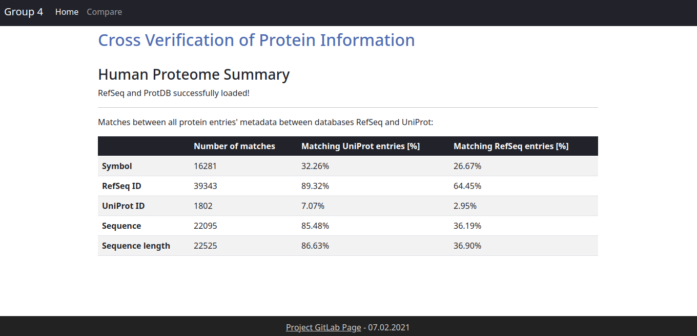
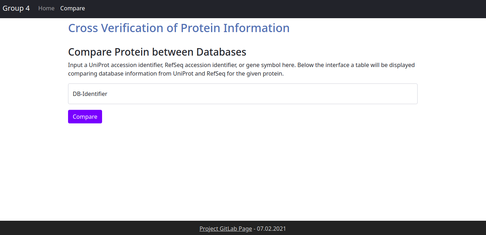

<!-- PROJECT SHIELDS -->
<!--
*** https://www.markdownguide.org/basic-syntax/#reference-style-links
-->
[![Contributors][contributors-shield]][contributors-url]
[![Issues][issues-shield]][issues-url]


# DBInspector; Cross Verification of Protein Information
## UniProt and NCBI RefSeq Comparison and Harmonization

This project was made as part of the following curriculum:

[Programming Lab II - Life Science Informatics, University of Bonn](https://www.b-it-center.de/b-it-programmes/msc-in-life-science-informatics/description)

# DBInspector

<!-- TABLE OF CONTENTS -->
<details open="open">
  <summary>Table of Contents</summary>
  <ol>
    <li>
      <a href="#about-the-project">About The Project</a>
      <ul>
      </ul>
    </li>
    <li>
      <a href="#usage">Usage</a>
      <ul>
        <li><a href="#direct-usage">Direct Usage</a></li>
        <li><a href="#graphical-user-interface">GUI</a></li>
        <li><a href="#command-line-interface">CLI</a></li>
      </ul> 
    </li>   
      <li><a href="#contact">Contact</a></li>
      <li><a href="#acknowledgements">Acknowledgements</a></li>
  </ol>
</details>

<!-- ABOUT THE PROJECT -->
## About The Project
A bioinformatician trusts to find reliable protein information and up-to-date referencing in certain "gold standard" 
databases, such as [UniProt](https://www.uniprot.org/) and NCBI's [RefSeq](https://www.ncbi.nlm.nih.gov/refseq/).  

The **dbinspector** enables the trusting bioinformatician to cross-reference UniProt and RefSeq entries for human 
proteins and compare accession IDs, gene symbol, and amino acid sequence.  
He can pull up a summary of metadata alignment between databases, or explore information on a specific protein to map 
comparable metadata. Both options are available from the command line, as well as from the user-friendly web interface.


## Usage

To begin, clone the repository:

```git clone https://github.com/laurendelong21/DBInspector.git```

... navigate to the DBInspector directory, and install:

``` pip install dbi_pkg/ ```
  
  
Here are the 3 options for queries: 
- [direct](#direct-usage) usage with python, as illustrated in a Jupyter Notebook manual
- [GUI](#graphical-user-interface): Graphical User Interface
- [CLI](#command-line-interface): Command Line Interface

<!-- DIRECT-->
### Direct Usage

See the Jupyter Notebook [tutorial](tutorial.ipynb) for examples on how to use this package directly with Python.

<!-- GUI-->
### Graphical User Interface

For a user-friendly interface, navigate to the `group04` directory and execute:

```bash
python frontend/run.py
```

this will start up the GUI and display the proper link from which it can be accessed. The GUI is organized into two main parts. There is a *summary* page and *comparison page*.  
  
##### Summary page
On the initial startup the summary page shows an button that will populate the backend with the necessary data. After this step, an overview table with overlap statistics (in percentage) between the UniProt and RefSeq database is visible.  

  
##### Comparison page
After initialization, the comparison function can be used to lookup a RefSeq Accession ID, a UniProt ID or a Gene Symbol. If the lookup is successful, a comparison table will be shown contrasting the results from both databases. This include number of results, sequence, sequence length and identifier.  


<!-- CLI-->
### Command Line Interface

To use the command line interface, the user must first install the package.
Afterward, use `dbi` in the terminal followed by one of these commands:


|	command		|	description								|
|-----------|---------------------------|
|	parse		|	Parses the downloaded database data.|
|	compare	|	Searches databases for matches of given query, compares entries across databases and prints results.<br>Query can be UniProt ID, RefSeq ID, or gene symbol. Optionally saves results to a file|
|	database-summary	|	Calculates summary statistics comparing the entries in the UniProt and RefSeq databases.<br>Optionally saves results to a file.	|
|	check-age	|	Use this to check the age of raw and/or parsed files. 	|
|	clear-cache	|	 Use this to clear up the space used up by this program.|
  
  
##### parse
The parsing is necessary to restructure and internally store and restructured data from the databases.  
This should be run first and only needs to be run once in the beginning.
  
  
##### compare
Gets the corresponding RefSeq and UniProt information on a given UniProt ID, RefSeq ID, or gene symbol query, and visualizes it in a table, which can be stored in a tsv file (-o) optionally.
| option        | 	description                             		          |
| --------------|---------------------------------------------------------|
| -q / --query	|	Database accession identifier or symbol to be compared.	|
| -o / --outfile|	Filepath for saving the results as a tsv.	|
  
    
##### database-summary
See a summary of the overall matches between RefSeq and UniProt entries for the categories:  
symbol, RefSeq ID, UniProt ID, sequence, sequence length  
| option        | 	description                             		          |
| --------------|---------------------------------------------------------|
| -o / --outfile|  	Filepath for saving the results as a tsv.	|
  
    
##### check-age
Use this to check the age of raw and/or parsed files- if no flag specified, will show age of raw files.  
| option        | 	description                             		          |
| --------------|---------------------------------------------------------|
| -p / --parsed	|	A flag indicating that user wants to see age of parsed data.	|
| -r / --raw    |	A flag indicating that user wants to see age of raw downloaded data.	|
  
  
##### clear-cache
Use this to clear the large, downloaded files from NCBI RefSeq and UniProt after parsing is done.  
Clearing the parsed data as well using the flag `-a` frees up an additional ~50 MB of space **BUT** compromises the functionality of the DBInspector. To restore functionality, rerun the parsing. 
| option        | 	description                             		          |
| --------------|---------------------------------------------------------|
| -a / --all_data|Clear entire cache: Downloaded data as well as parsed files. Else only downloaded data.|
  
  
#### help
Show options and help on any of the CLI commands or an overview with all commands using `--help`:
```bash
dbi command --help
```
```bash
dbi --help
```
<!-- CONTACT -->
## Contact

* **Lauren DeLong** - laurendelong21@gmail.com - [GitHub](https://github.com/laurendelong21)
* **Rebeca Figueiredo** - s6refigu@uni-bonn.de - [GitLab](https://gitlab.informatik.uni-bonn.de/figueire)  
* **Simon Müller** - s.mueller1995@gmail.com - [GitLab](https://gitlab.informatik.uni-bonn.de/mueller9)  
* **Maren Philipps** - maren.philipps@uni-bonn.de - [GitHub](https://github.com/philohippo)  

<!-- ACKNOWLEDGEMENTS -->
## Acknowledgements
* [GitLab Pages](https://about.gitlab.com/)
* [README template](https://github.com/othneildrew/Best-README-Template)
* Distributed under the MIT License. See [LICENSE](liscence-url) for more information.


<!-- MARKDOWN LINKS & IMAGES -->
<!-- https://www.markdownguide.org/basic-syntax/#reference-style-links -->
[contributors-shield]: https://img.shields.io/github/contributors/philohippo/DBInspector.svg?style=for-the-badge
[contributors-url]: https://gitlab-sysprog.informatik.uni-bonn.de/bschultz/group04/-/graphs/master
[issues-shield]: https://img.shields.io/github/issues/philohippo/DBInspector.svg?style=for-the-badge
[issues-url]: https://gitlab-sysprog.informatik.uni-bonn.de/bschultz/group04/-/issues
